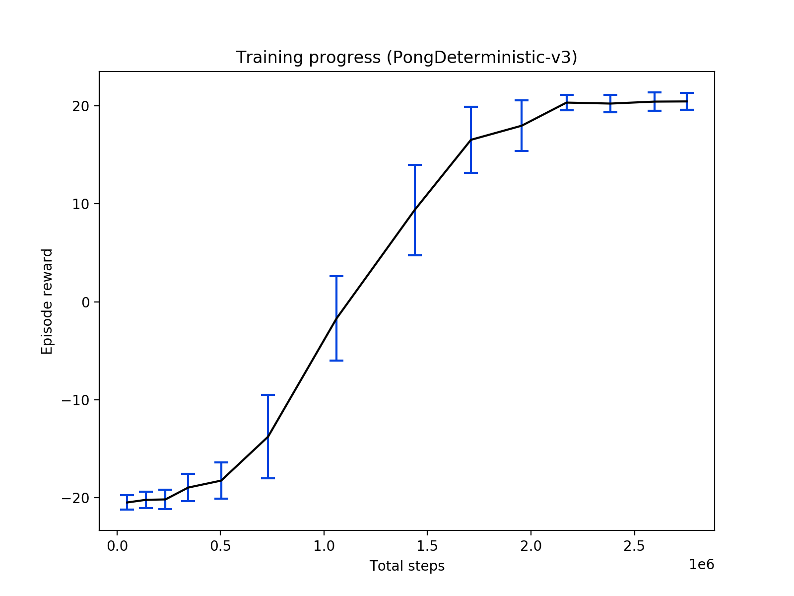

# A2C
PyTorch implementation of Advantage Actor-Critic (A2C)

## Usage

Example command line usage:
````
python main.py BreakoutDeterministic-v3 --num-workers 8 --render
````
This will train the agent on BreakoutDeterministic-v3 with 8 parallel environments, and render each environment.

Example training curve for `PongDeterministic-v3`:



## References

#### Code

This code uses Gym environment utilities from these repos:

[openai/baselines](https://github.com/openai/baselines)

[openai/universe-starter-agent](https://github.com/openai/universe-starter-agent)

[ikostrikov/pytorch-a3c](https://github.com/ikostrikov/pytorch-a3c)

#### Literature

[High-Dimensional Continuous Control Using Generalized Advantage Estimation](https://arxiv.org/abs/1506.02438)

[Asynchronous Methods for Deep Reinforcement Learning](https://arxiv.org/abs/1602.01783)

[OpenAI Baselines: ACKTR & A2C](https://blog.openai.com/baselines-acktr-a2c/)
